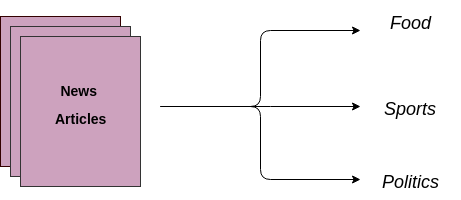

# Data Science Portfolio
---
## Machine learning

### Generic Chatbot

This Application can answer questions to any domain relating to the given corpus of data.

---
### Xray Analysis using Convolutional Neural Network

Convolutional Neural Network is used to analyse a set of xrays and then predict if a person is being affected by pneumonia or not.

---
### LSTM Neural Network for Sentence Category Prediction

This Project is intented to study the given sentence with the help of Long Short Term Memory Network and analyse the new sentence into any one of the trained category.

---
### Distraction Detector

According to the CDC motor vehicle safety division, one in five car accidents is caused by a distracted driver. Sadly, this translates to 425,000 people injured and 3,000 people killed by distracted driving every year.

In Order to reduce it this ,i have developed a machine learning model that as been traied with multiple classes of actions performed by a driver.if the driver is found to do any other action other that safe driving an alert will be triggered.

---
### Generative Adversarial Network

This Generative Adversarial Network is trained on many images of dogs and can generate fake images of the dogs.

---
### Sentiment Analysis

Sentiment analysis system to predict the emotion on the viewers made with the data from imdb Dataset

---

